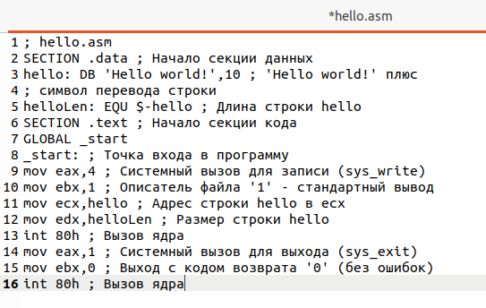
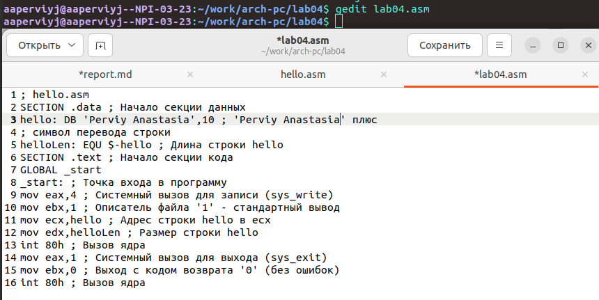

---
## Front matter
title: "Шаблон отчёта по лабораторной работе"
subtitle: "Простейший вариант"
author: "Дмитрий Сергеевич Кулябов"

## Generic otions
lang: ru-RU
toc-title: "Содержание"

## Bibliography
bibliography: bib/cite.bib
csl: pandoc/csl/gost-r-7-0-5-2008-numeric.csl

## Pdf output format
toc: true # Table of contents
toc-depth: 2
lof: true # List of figures
lot: true # List of tables
fontsize: 12pt
linestretch: 1.5
papersize: a4
documentclass: scrreprt
## I18n polyglossia
polyglossia-lang:
  name: russian
  options:
	- spelling=modern
	- babelshorthands=true
polyglossia-otherlangs:
  name: english
## I18n babel
babel-lang: russian
babel-otherlangs: english
## Fonts
mainfont: PT Serif
romanfont: PT Serif
sansfont: PT Sans
monofont: PT Mono
mainfontoptions: Ligatures=TeX
romanfontoptions: Ligatures=TeX
sansfontoptions: Ligatures=TeX,Scale=MatchLowercase
monofontoptions: Scale=MatchLowercase,Scale=0.9
## Biblatex
biblatex: true
biblio-style: "gost-numeric"
biblatexoptions:
  - parentracker=true
  - backend=biber
  - hyperref=auto
  - language=auto
  - autolang=other*
  - citestyle=gost-numeric
## Pandoc-crossref LaTeX customization
figureTitle: "Рис."
tableTitle: "Таблица"
listingTitle: "Листинг"
lofTitle: "Список иллюстраций"
lotTitle: "Список таблиц"
lolTitle: "Листинги"
## Misc options
indent: true
header-includes:
  - \usepackage{indentfirst}
  - \usepackage{float} # keep figures where there are in the text
  - \floatplacement{figure}{H} # keep figures where there are in the text
---

# Цель работы

Целью данной работы является приобретение практического опыта работы с программами, написанными на ассемблере NASM, а именно - освоение процедур компиляций и сборки.

# Задание

1. Создание программы Hello World!
1. Работа с транслятором NASM
2. Работа с расширенным синтаксисом командной строки NASM
2. Работа с компоновщиком LD
3. Запуск исполняемого файла
3. Выполнение заданий для самостоятельной работы
	
# Теоретическое введение

 Язык ассемблера (assembly language, сокращённо asm) — машинно-ориентированный язык низкого уровня. Можно считать, что он больше любых других языков приближен к архитектуре ЭВМ и её аппаратным возможностям, что позволяет получить к ним более полный доступ, нежели в языках высокого уровня,таких как C/C++, Perl, Python и пр. Но получить полный доступ к ресурсам компьютера в современных архитектурах нельзя, самым низким уровнем работы прикладной программы является обращение напрямую к ядру операционной системы. Именно на этом уровне и работают программы, написанные на ассемблере. Но в отличие от языков высокого уровня ассемблерная программа содержит только тот код, который ввёл программист. Таким образом язык ассемблера — это язык, с помощью которого понятным для человека образом пишутся команды для процессора.
 Следует отметить, что процессор понимает не команды ассемблера, а последовательности из нулей и единиц — машинные коды. До появления языков ассемблера программистам приходилось писать программы, используя только лишь машинные коды, которые были крайне сложны для запоминания, так как представляли собой числа, записанные в двоичной или шестнадцатеричной системе счисления. Преобразование или трансляция команд с языка ассемблера в исполняемый машинный код осуществляется специальной программой транслятором
 Программы, написанные на языке ассемблера, не уступают в качестве и скорости программам, написанным на машинном языке, ибо транслятор просто переводит мнемоническиеиобозначения команд в последовательности бит (нулей и единиц). Используемые мнемоники обычно одинаковы для всех процессоров одной архитектуры или семейства архитектур (среди широко известных — мнемоники процессоров и контроллеров x86, ARM, SPARC, PowerPC,M68k). Таким образом для каждой архитектуры существует свой ассемблер и, соответственно, свой язык ассемблера.
 Наиболее распространёнными ассемблерами для архитектуры x86 являются:
1) Для DOS/Windows: Borland Turbo Assembler (TASM), Microsoft Macro Assembler (MASM) и Watcom assembler (WASM).
2) Для GNU/Linux: gas (GNU Assembler), использующий AT&T-синтаксис, в отличие отбольшинства других популярных ассемблеров, которые используют Intel-синтаксис.
 Для записи команд в NASM используются:
1) Мнемокод— непосредственно мнемоника инструкции процессору, которая является обязательной частью команды. 
2) Операнды - числа, данные, адреса регистров или адреса оперативной памяти. 
3) Метка — идентификатор, с которым ассемблер ассоциирует некоторое число, чаще всего адрес в памяти. (Метка перед командой связана с адресом данной команды). Допустимыми символами в метках являются буквы, цифры, а также следующие символы:
 _, $, #, @,~,. и ?.
 Начинаться метка или идентификатор могут с буквы, ., _ и ?.
 Перед идентификаторами, которые пишутся как зарезервированные слова, нужно писать $, чтобы компилятор трактовал его верно (так называемое экранирование). Максимальная длина идентификатора составляет 4095 символов.
 Программа на языке ассемблера также может содержать директивы — инструкции, не переводящиеся непосредственно в машинные команды, а управляющие работой транслятора. Например, директивы используются для определения данных (констант и переменных) и обычно пишутся большими буквами.

# Выполнение лабораторной работы

## Создание программы Hello World!
  Для создания простой программы, которая выводит сообщение **Hello world!**, необходимо создать каталог, в котором дальше будем работать с программами на языке ассемблере NASM. Для этого в терминале необходимо прописать команду **mkdir -p ~/work/arch-pc/lab04** (Рис. @fig:001)
  
{#fig:001 width=70%}

Далее создаю текстовый файл **hello.asm** (Рис. @fig:002)

{#fig:002 width=70%}

Открываем файл для дальнейшего ввода теста команды (Рис. @fig:003)

{#fig:003 width=70%}

Ввожу текст программы (Рис. @fig:004)

{#fig:004 width=70%}

## Работа с транслятором NASM

Чтобы команда заработала, необходимо скомпилировать приведенный тект, для этого нужно прописать команду **nasm -f elf hello.asm** Выдало ошибку, так как у меня не было необходимой утилиты, поэтому я установила утилиту nasm (Рис. @fig:005)

{#fig:005 width=70%}

После установки необходимых утилит, пробую прописать команду **nasm -f elf hello.asm** еще раз (Рис. @fig:006)

{#fig:006 width=70%}

## Работа с расширенным синтаксисом командной строки NASM

Теперь необходимо скомпилировать файл **hello.asm** в файл **obj.o** При кмпиляции будут включены символы для отладки: ключ **-g**, также с помощью ключа **-l** будет создан файл листинга **list.lst** Проверяю правильность выполнения команды (рис. @fig:007)

{#fig:007 width=70%}

## Работа с компоновщиком LD

Чтобы получить исполняемую команду, необходимо передать объектный файл на обработку компоновщиу LD. Передаю файлы **hello.o** и **obj.o** (рис. @fig:008)

{#fig:008 width=70%}

## Запуск исполняемого файла

Теперь можно запустить созданный исполняемый файл **hello**. Для этого ввожу команду в текущем каталоге **./hello** (рис. @fig:009)

{#fig:009 width=70%}

## Выполнение заданий для самостоятельной работы

 1. В каталоге **~/work/arch-pc/lab04** с помощью команды **cp** создаю копию файла
**hello.asm** с именем **lab04.asm** (рис. @fig:010)

{#fig:010 width=70%}

 2. С помощью текстового редактора вношу изменения в текст программы в
файле **lab4.asm** так, чтобы вместо **Hello world!** на экран выводилась строка с моими фамилией и именем (рис. @fig:011)

{#fig:011 width=70%}

3. Оттранслирую полученный текст программы **lab4.asm** в объектный файл. Выполняю
компоновку объектного файла и запускаю получившийся исполняемый файл  (рис. @fig:012)

{#fig:012 width=70%}

4. Копирую файлы **hello.asm** и **lab4.asm** в свой локальный репозиторий в ката-
лог **~/work/study/2023-2024/"Архитектура компьютера"/arch-pc/labs/lab04/**
Загружаю файлы на Github (рис. @fig:013)

::: {#refs}
:::
