---
## Front matter
title: "Лабораторная работа №5"
subtitle: "Дисциплина: Архитектура компьютера"
author: "Первий Анастасия Андреевна"

## Generic otions
lang: ru-RU
toc-title: "Содержание"

## Bibliography
bibliography: bib/cite.bib
csl: pandoc/csl/gost-r-7-0-5-2008-numeric.csl

## Pdf output format
toc: true # Table of contents
toc-depth: 2
lof: true # List of figures
lot: true # List of tables
fontsize: 12pt
linestretch: 1.5
papersize: a4
documentclass: scrreprt
## I18n polyglossia
polyglossia-lang:
  name: russian
  options:
	- spelling=modern
	- babelshorthands=true
polyglossia-otherlangs:
  name: english
## I18n babel
babel-lang: russian
babel-otherlangs: english
## Fonts
mainfont: PT Serif
romanfont: PT Serif
sansfont: PT Sans
monofont: PT Mono
mainfontoptions: Ligatures=TeX
romanfontoptions: Ligatures=TeX
sansfontoptions: Ligatures=TeX,Scale=MatchLowercase
monofontoptions: Scale=MatchLowercase,Scale=0.9
## Biblatex
biblatex: true
biblio-style: "gost-numeric"
biblatexoptions:
  - parentracker=true
  - backend=biber
  - hyperref=auto
  - language=auto
  - autolang=other*
  - citestyle=gost-numeric
## Pandoc-crossref LaTeX customization
figureTitle: "Рис."
tableTitle: "Таблица"
listingTitle: "Листинг"
lofTitle: "Список иллюстраций"
lotTitle: "Список таблиц"
lolTitle: "Листинги"
## Misc options
indent: true
header-includes:
  - \usepackage{indentfirst}
  - \usepackage{float} # keep figures where there are in the text
  - \floatplacement{figure}{H} # keep figures where there are in the text
---

# Цель работы

Целью данной лабораторной работы является приобретение практических навыков работы в **Midnight Commander**. А также освоение инструкций языка ассемблера **mov** и **int**.

# Задание

0. Подготовка пространства для выполнения лабораторной работы
1. Программа вывода сообщения на экран и ввода строки с клавиатуры
1. Подключение внешнего файла in_out.asm
2. Программа вывода сообщений с использованием подключенного ранее файла
2. Самостоятельная работа. Создание исполняемого файла

# Теоретическое введение

**Midnight Commander** (или просто mc) — это программа, которая позволяет просматривать
структуру каталогов и выполнять основные операции по управлению файловой системой,
т.е. mc является файловым менеджером. Midnight Commander позволяет сделать работу с
файлами более удобной и наглядной.

**Структара:**

Программа на языке ассемблера NASM, как правило, состоит из трёх секций: секция кода
программы (SECTION .text), секция инициированных (известных во время компиляции)
данных (SECTION .data) и секция неинициализированных данных (тех, под которые во
время компиляции только отводится память, а значение присваивается в ходе выполнения
программы) (SECTION .bss).

Для объявления инициированных данных в секции .data используются директивы DB, DW,
DD, DQ и DT, которые резервируют память и указывают, какие значения должны храниться в
этой памяти:
• DB (define byte) — определяет переменную размером в 1 байт;
• DW (define word) — определяет переменную размеров в 2 байта (слово);
• DD (define double word) — определяет переменную размером в 4 байта (двойное слово);
• DQ (define quad word) — определяет переменную размером в 8 байт (учетверённое слово);
• DT (define ten bytes) — определяет переменную размером в 10 байт.

Директивы используются для объявления простых переменных и для объявления масси-
вов. Для определения строк принято использовать директиву DB в связи с особенностями
хранения данных в оперативной памяти.
Синтаксис директив определения данных следующий:

<имя> DB <операнд> [, <операнд>] [, <операнд>]

# Выполнение лабораторной работы

Чтобы начать работать над выполнением лабораторной работы, целью которой является приобретение практических навыков работы в **Midnight Commander**, необхожимо его открыть.

## Подготовка пространства для выполнения лабораторной работы

Откроем терминал и впишем команду **mc**, необходимую для открытия **Midnight Commander**.(Рис.1 @fig:001)

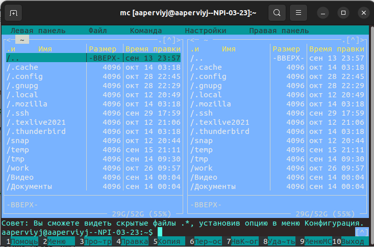{#fig:001 width=70%} 

Теперь нужно перейти в нужный каталог **~/work/arch-pc** и создать там папку **lab05** (Рис.2 @fig:002)

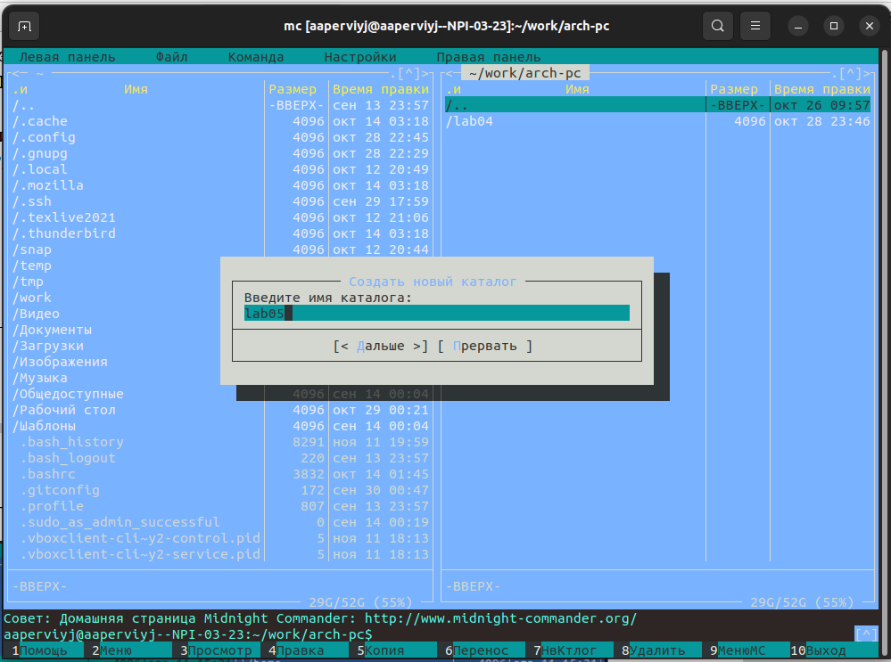{#fig:002 width=70%}

Пользуясь строкой ввода и командой **touch**, необходимо создать файл **lab5-1.asm** (Рис.3 @fig:003)

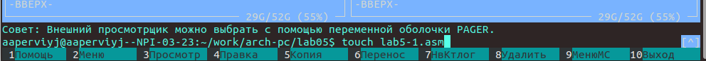{#fig:003 width=70%}

## Программа вывода сообщения на экран и ввода строки с клавиатуры

С помощью функциональной клавиши **F4** необходимо открыть созданный ранее файл **lab5-1.asm** для редактирова-
ния во встроенном редакторе. Как правило в качестве встроенного редактора Midnight
Commander используется редакторы **nano** или **mcedit**. Я буду использовать редактор **nano**

Я нажала клавишу **F4** и открылся термимнал, где необходимо выбрать редактор (Рис.4 @fig:004)

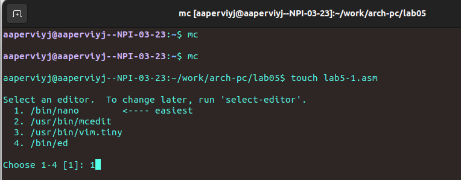{#fig:004 width=70%}

После того, как я ввела **1** и нажала клавишу **Enter** открылся сам файл, с помощью выбранного редактора **nano** (Рис.5 @fig:005)

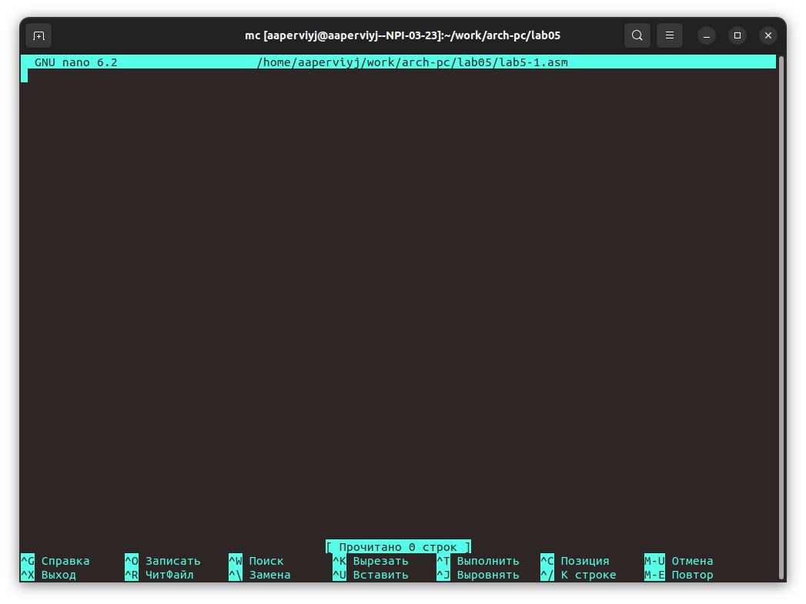{#fig:005 width=70%}

Для создания *программы вывода сообщения на экран и ввода строки с клавиатуры* нужно ввести нужный текст из **листинга 5.1** (Список используемых листингов приведен ниже). Копирую и вставляю текст программы (Рис.6 @fig:006)

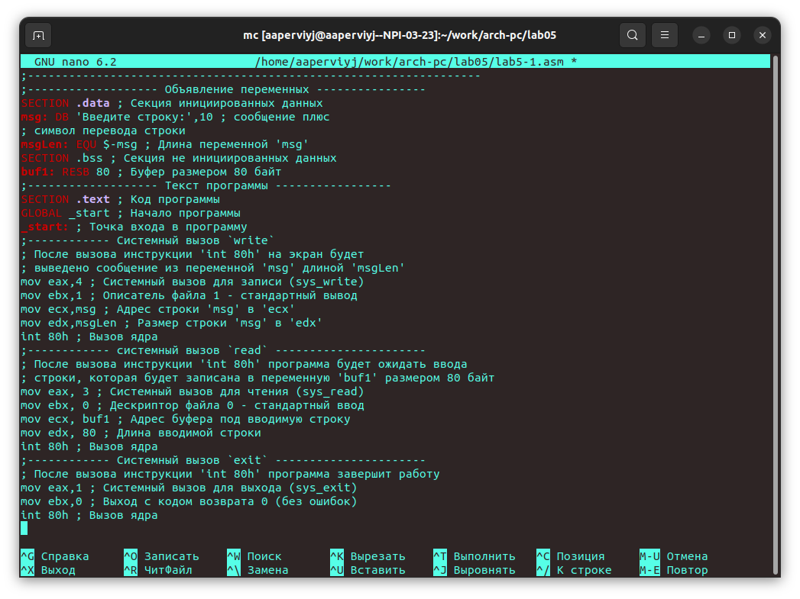{#fig:006 width=70%}

Сохраняю изменения и закрываю редактор с помощью последовательности клавиш *Ctrl + X(выход)  ->  Y(сохранение изменений)  ->  Enter* (Рис.7 @fig:007)

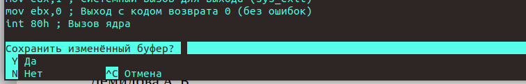{#fig:007 width=70%}

Проверяю сохранилсь ли изменения, с помощью клавиши **f3** (Рис.8 @fig:008)

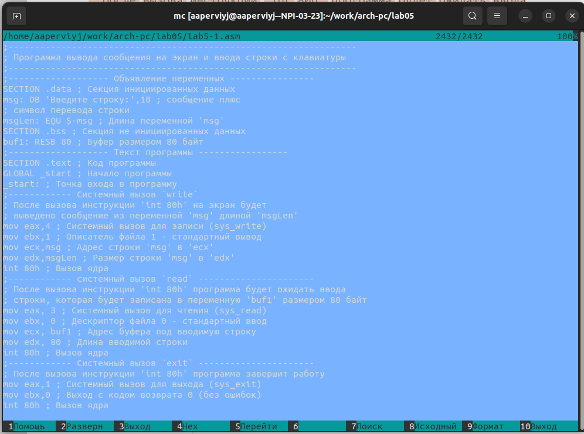{#fig:008 width=70%}

Транслирую текст программы **lab5-1.asm** в объектный файл.Выполняю компоновку объектного файла и запускаю 
Ваши ФИО получившийся исполняемый файл. Программа выводит строку *'Введите строку:'* и ожидает ввода с клавиатуры. На запрос ввожу ФИО (Рис.9 @fig:009)

{#fig:009 width=70%}

## Подключение внешнего файла in_out.asm

Для выполнения данного пункта лабораторной работы необходимо скачать файл из ТУИС **n_out.asm**. Подключаемый файл должен лежать в том же каталоге, что и файл с программой, в которой он используется. Поэтому опять открываем **Midnight Commander** и на первой панели открываем каталог, в котором находится файл, а на второй каталог, куда его нужно скопировать (Рис.10 @fig:010)
*Ctrl + X(выход)  ->  Y(сохранение изменений)  ->  Enter*
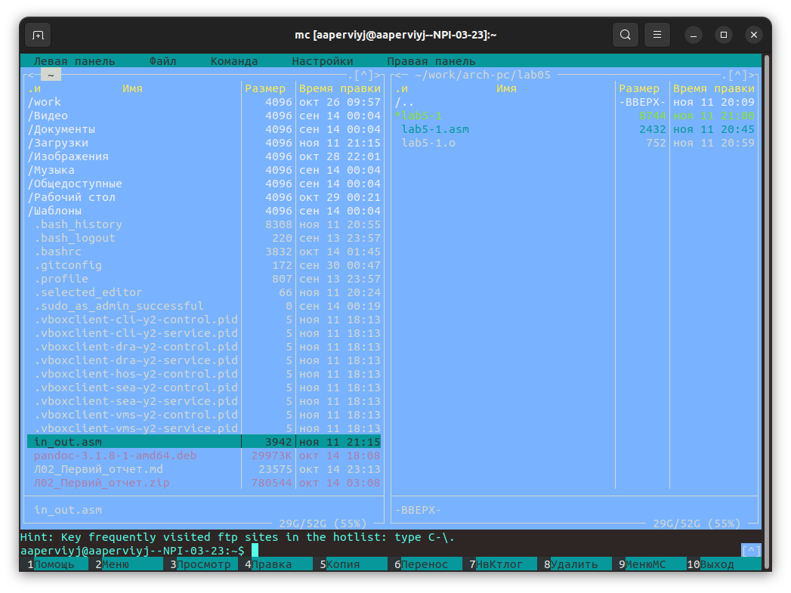{#fig:010 width=70%}

Теперь, когда все готово для копирования, нажмимаю клавишу **F5**(с помощью этой клавиши файл можно скопировать из одного каталога в другой). (Рис.11 @fig:011)

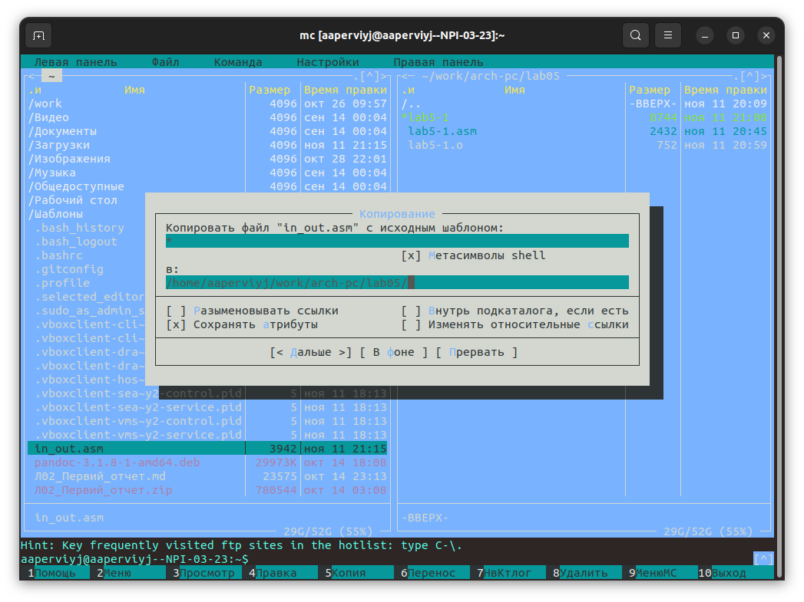{#fig:011 width=70%}

Проверяю скопироввался ли файл (Рис.12 @fig:012)

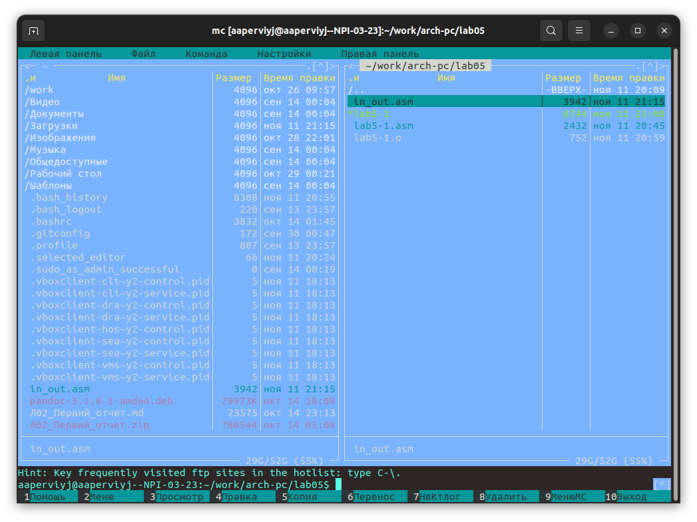{#fig:012 width=70%}

## Программа вывода сообщений с использованием подключенного ранее файла

Для выполнения данного пункта лабораторнрой работы необходимо создать копию  файла **lab5-1.asm** под другим именем **lab5-2.asm**. Для это7го нужно нажать клавишу **F6** и поменять название (Рис.13 @fig:013)

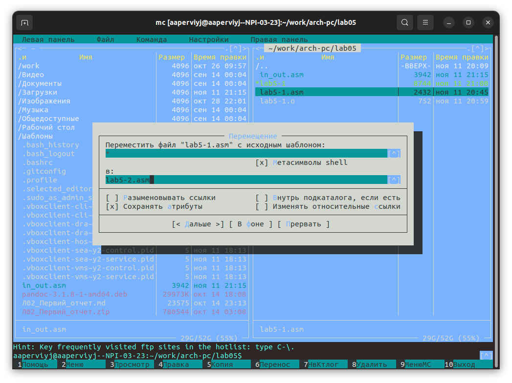{#fig:013 width=70%}

Видим появившийся файл с именем **lab5-2.asm**, значит я сделала все правильно (Рис.14 @fig:014)

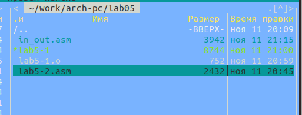{#fig:014 width=70%}

Так как новый файл **lab5-2.asm** это файл **lab5-1.asm** просто с другим названием, текст программы старый. Его необходимо исправить и вставить туда текст программы из **листинга5.2**
Снова нажимаю клавишу **F4**, чтобы отредактировать файл и потом сохранить изменения с помощью комбинации клавиш *Ctrl + X(выход)  ->  Y(сохранение изменений)  ->  Enter* (Рис.15 @fig:015)

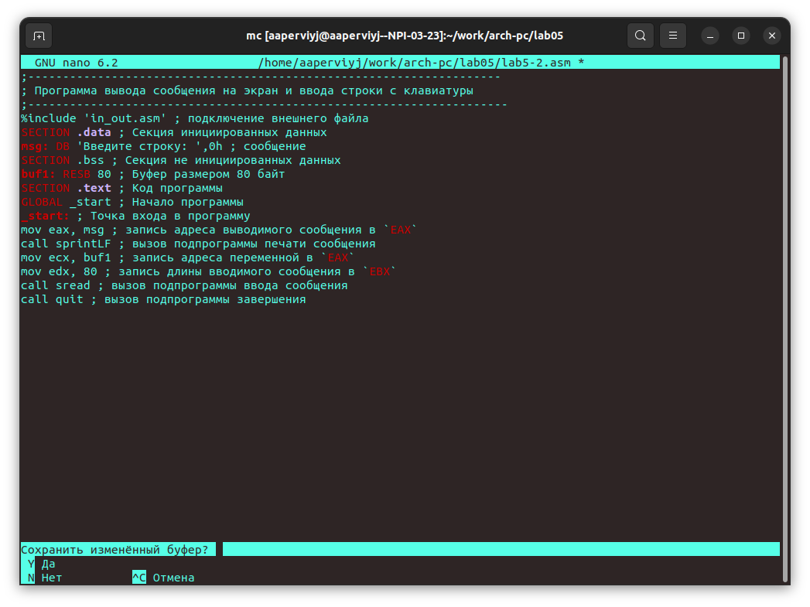{#fig:015 width=70%}

Проверяю сохранились ли изменения (Рис.16 @fig:016)

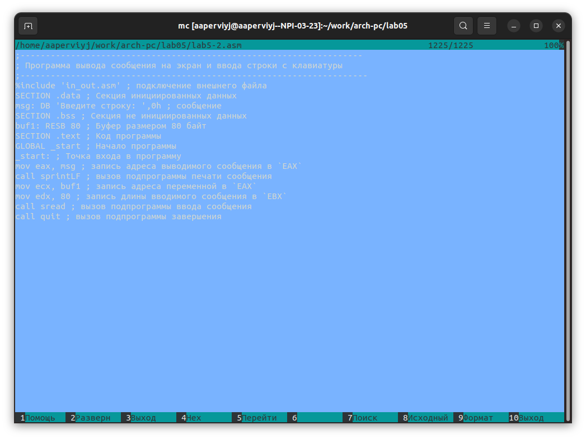{#fig:016 width=70%}

Транслирую текст программы **lab5-2.asm** в объектный файл.Выполняю компоновку объектного файла и запускаю 
Ваши ФИО получившийся исполняемый файл. Программа выводит строку *'Введите строку:'* и ожидает ввода с клавиатуры. На запрос ввожу ФИО (Рис.17 @fig:017)

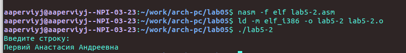{#fig:017 width=70%}

В файле **lab5-2.asm** заменяю подпрограмму *sprintLF* на *sprint*. Создаю исполняемый файл и проверяю его работу(Рис.18 @fig:018) 

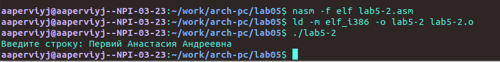{#fig:018 width=70%}

Сразу заметна разница при вводе сообщения. Подпрограмма *sprintLF* выводит сообщение с новой строки, а подпрограмма *sprint* на той же.

## Самостоятельная работа. Создание исполняемого файла

В задании для самостоятельной работы необходимо созать копии файлов и внести изменения в программы, чтобы они работали следующим образом: 
• вывести приглашение типа “Введите строку:”;
• ввести строку с клавиатуры;
• вывести введённую строку на экран

Копирую файл **lab5-2.asm** с именем **lab5-1.asm**.(Рис.19 @fig:019)

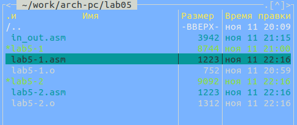{#fig:019 width=70%}

Вношу изменения в программу (без использования внешнего файла in_out.asm) и сохраняю. Делаю проверку с помощью клавиши **F3** (Рис.20 @fig:020)

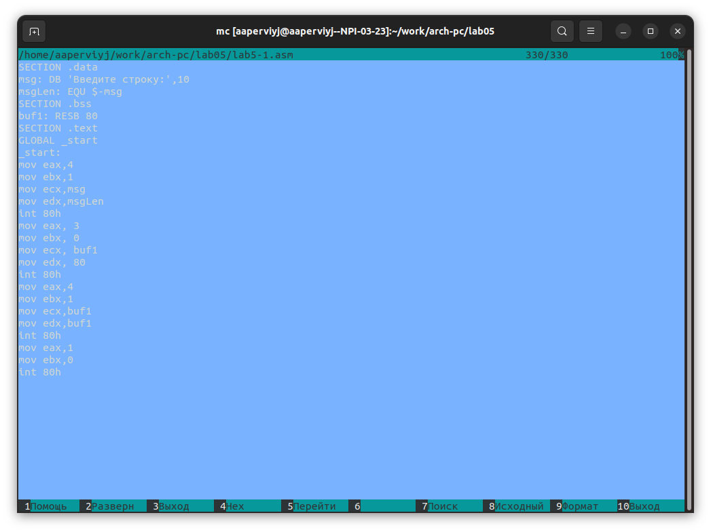{#fig:020 width=70%}
 
То же самое делаю и с файлом **lab5-2.asm** (Рис.21 @fig:021)

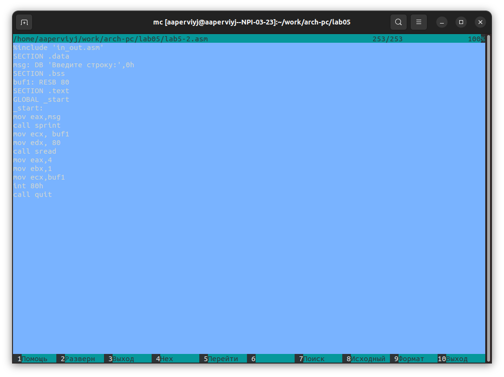{#fig:021 width=70%}

Создаю исполняемые файлы и проверяю их работу (Рис.22 @fig:022) и (Рис.23 @fig:023)

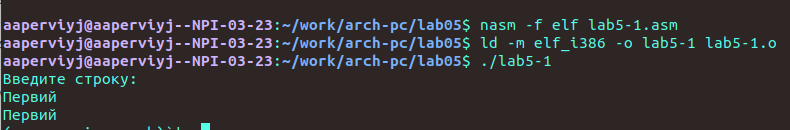{#fig:022 width=70%}

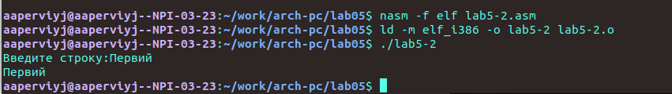{#fig:023 width=70%}

Программы работают исправно, заданий больше нет, лабораторная работа выполнена.

# Выводы

В ходе выполнения лаборатроной работы я приоблела практические навыки работы в **MidnightCommander** и осовила иструкции языка ассеиблера *mov* и *int*

# Листинги

**Листинг 5.1. Программа вывода сообщения на экран и ввода строки с клавиатуры**
;------------------------------------------------------------------
; Программа вывода сообщения на экран и ввода строки с клавиатуры
;------------------------------------------------------------------
;------------------- Объявление переменных ----------------
SECTION .data ; Секция инициированных данных
msg: DB 'Введите строку:',10 ; сообщение плюс
; символ перевода строки
msgLen: EQU $-msg ; Длина переменной 'msg'
SECTION .bss ; Секция не инициированных данных
buf1: RESB 80 ; Буфер размером 80 байт
;------------------- Текст программы -----------------
SECTION .text ; Код программы
GLOBAL _start ; Начало программы
_start: ; Точка входа в программу
;------------ Cистемный вызов `write`
; После вызова инструкции 'int 80h' на экран будет
; выведено сообщение из переменной 'msg' длиной 'msgLen'
mov eax,4 ; Системный вызов для записи (sys_write)
mov ebx,1 ; Описатель файла 1 - стандартный вывод
mov ecx,msg ; Адрес строки 'msg' в 'ecx'
mov edx,msgLen ; Размер строки 'msg' в 'edx'
int 80h ; Вызов ядра
;------------ системный вызов `read` ----------------------
; После вызова инструкции 'int 80h' программа будет ожидать ввода
; строки, которая будет записана в переменную 'buf1' размером 80 байт
mov eax, 3 ; Системный вызов для чтения (sys_read)
mov ebx, 0 ; Дескриптор файла 0 - стандартный ввод
mov ecx, buf1 ; Адрес буфера под вводимую строку
mov edx, 80 ; Длина вводимой строки
int 80h ; Вызов ядра
;------------ Системный вызов `exit` ----------------------
; После вызова инструкции 'int 80h' программа завершит работу
mov eax,1 ; Системный вызов для выхода (sys_exit)
mov ebx,0 ; Выход с кодом возврата 0 (без ошибок)
int 80h ; Вызов ядра

**Листинг 5.2. Программа вывода сообщения на экран и ввода строки с клавиатуры c использованием файла in_out.asm**
;--------------------------------------------------------------------
; Программа вывода сообщения на экран и ввода строки с клавиатуры
;---------------------------------------------------------------------
%include 'in_out.asm' ; подключение внешнего файла
SECTION .data ; Секция инициированных данных
msg: DB 'Введите строку: ',0h ; сообщение
SECTION .bss ; Секция не инициированных данных
buf1: RESB 80 ; Буфер размером 80 байт
SECTION .text ; Код программы
GLOBAL _start ; Начало программы
_start: ; Точка входа в программу
mov eax, msg ; запись адреса выводимого сообщения в `EAX`
call sprintLF ; вызов подпрограммы печати сообщения
mov ecx, buf1 ; запись адреса переменной в `EAX`
mov edx, 80 ; запись длины вводимого сообщения в `EBX`
call sread ; вызов подпрограммы ввода сообщения
call quit ; вызов подпрограммы завершения

# Список литературы{.unnumbered}

[Архитектура ЭВМ](https://esystem.rudn.ru/pluginfile.php/2089658/mod_resource/content/0/%D0%9B%D0%B0%D0%B1%D0%BE%D1%80%D0%B0%D1%82%D0%BE%D1%80%D0%BD%D0%B0%D1%8F%20%D1%80%D0%B0%D0%B1%D0%BE%D1%82%D0%B0%20%E2%84%965.%20%D0%9E%D1%81%D0%BD%D0%BE%D0%B2%D1%8B%20%D1%80%D0%B0%D0%B1%D0%BE%D1%82%D1%8B%20%D1%81%20Midnight%20Commander%20%28%29.%20%D0%A1%D1%82%D1%80%D1%83%D0%BA%D1%82%D1%83%D1%80%D0%B0%20%D0%BF%D1%80%D0%BE%D0%B3%D1%80%D0%B0%D0%BC%D0%BC%D1%8B%20%D0%BD%D0%B0%20%D1%8F%D0%B7%D1%8B%D0%BA%D0%B5%20%D0%B0%D1%81%D1%81%D0%B5%D0%BC%D0%B1%D0%BB%D0%B5%D1%80%D0%B0%20NASM.%20%D0%A1%D0%B8%D1%81%D1%82%D0%B5%D0%BC%D0%BD%D1%8B%D0%B5%20%D0%B2%D1%8B%D0%B7%D0%BE%D0%B2%D1%8B%20%D0%B2%20%D0%9E%D0%A1%20GNU%20Linux.pdf)
