---
## Front matter
title: "Лабораторная работа №6"
subtitle: "Дисциплина: Архитектура компьютера"
author: "Первий Анастасия Андреевна"

## Generic otions
lang: ru-RU
toc-title: "Содержание"

## Bibliography
bibliography: bib/cite.bib
csl: pandoc/csl/gost-r-7-0-5-2008-numeric.csl

## Pdf output format
toc: true # Table of contents
toc-depth: 2
lof: true # List of figures
lot: true # List of tables
fontsize: 12pt
linestretch: 1.5
papersize: a4
documentclass: scrreprt
## I18n polyglossia
polyglossia-lang:
  name: russian
  options:
	- spelling=modern
	- babelshorthands=true
polyglossia-otherlangs:
  name: english
## I18n babel
babel-lang: russian
babel-otherlangs: english
## Fonts
mainfont: PT Serif
romanfont: PT Serif
sansfont: PT Sans
monofont: PT Mono
mainfontoptions: Ligatures=TeX
romanfontoptions: Ligatures=TeX
sansfontoptions: Ligatures=TeX,Scale=MatchLowercase
monofontoptions: Scale=MatchLowercase,Scale=0.9
## Biblatex
biblatex: true
biblio-style: "gost-numeric"
biblatexoptions:
  - parentracker=true
  - backend=biber
  - hyperref=auto
  - language=auto
  - autolang=other*
  - citestyle=gost-numeric
## Pandoc-crossref LaTeX customization
figureTitle: "Рис."
tableTitle: "Таблица"
listingTitle: "Листинг"
lofTitle: "Список иллюстраций"
lotTitle: "Список таблиц"
lolTitle: "Листинги"
## Misc options
indent: true
header-includes:
  - \usepackage{indentfirst}
  - \usepackage{float} # keep figures where there are in the text
  - \floatplacement{figure}{H} # keep figures where there are in the text
---

# Цель работы

Целью данной лабораторной рабоыт является освоение арифметических инструкций языка ассемблера NASM.

# Задание

0. Символьные и численные данные в NASM
0. Программа вывода значения регистра eax(I)
1. Программа вывода значения регистра eax(II)
1. Выполнение арифметических операций в NASM
2. Программа вычисления выражения
2. Программа вычисления вычисления варианта задания по номеру студенческого билета
3. Задание для самостоятельной работы

# Теоретическое введение

**Адресация в NASM**

Большинство инструкций на языке ассемблера требуют обработки операндов. Адрес операнда предоставляет место, где хранятся данные, подлежащие обработке. Это могут быть данные хранящиеся в регистре или в ячейке памяти. 

 Существует три основных способа адресации:
• Регистровая адресация – операнды хранятся в регистрах и в команде используются имена этих регистров, например: mov ax,bx.
• Непосредственная адресация – значение операнда задается непосредственно в команде, например: mov ax,2.
• Адресация памяти – операнд задает адрес в памяти. В команде указывается символическое обозначение ячейки памяти, над содержимым которой требуется выполнить операцию.

**Арифметические операции в NASM. Целочисленное сложение add.**

Схема команды целочисленного сложения **add** (от англ. addition - добавление) выполняет сложение двух операндов и записывает результат по адресу первого операнда. Команда **add** работает как с числами со знаком, так и без знака и выглядит следующим образом:

*add <операнд_1>, <операнд_2>*

**Целочисленное вычитание sub.**
Команда целочисленного вычитания **sub** (от англ. subtraction – вычитание) работает аналогично команде **add** и выглядит следующим образом:

*sub <операнд_1>, <операнд_2>*

Так, например, команда *sub ebx,5* уменьшает значение регистра **ebx** на 5 и записывает результат в регистр ebx

**Команды инкремента и декремента.**

Довольно часто при написании программ встречается операция прибавления или вычитания единицы. Прибавление единицы называется инкрементом, а вычитание — декрементом. Для этих операций существуют специальные команды: **inc** (от англ. increment) и **dec** (от англ. decrement), которые увеличивают и уменьшают на 1 свой операнд. Эти команды содержат один операнд и имеет следующий вид:

*inc <операнд>*
*dec <операнд>*

Операндом может быть регистр или ячейка памяти любого размера. Команды инкремента и декремента выгодны тем, что они занимают меньше места, чем соответствующие команды сложения и вычитания. Так, например, команда *inc ebx* увеличивает значение регистра **ebx** на 1, а команда *inc ax* уменьшает значение регистра **ax** на 1.

**Команда изменения знака операнда neg.**

Еще одна команда, которую можно отнести к арифметическим командам это команда изменения знака **neg**:

*neg <операнд>*

Команда *neg* рассматривает свой операнд как число со знаком и меняет знак операнда на противоположный. Операндом может быть регистр или ячейка памяти любого размера.

**mov ax,1	; AX = 1**
**neg ax 	; AX = -1**

**Команды умножения mul и imul.**

Умножение и деление, в отличии от сложения и вычитания, для знаковых и беззнаковых чисел производиться по-разному, поэтому существуют различные команды. Для беззнакового умножения используется команда mul (от англ. multiply – умножение):

mul <операнд>

Для знакового умножения используется команда imul:

imul <операнд>

Для команд умножения один из сомножителей указывается в команде и должен находиться в регистре или в памяти, но не может быть непосредственным операндом. Второй сомножитель в команде явно не указывается и должен находиться в регистре **EAX,AX** или **AL**, а результат помещается в регистры **EDX:EAX**, **DX:AX** или **AX**, в зависимости от размера операнда.

**Команды деления div и idiv.**

Для деления, как и для умножения, существует 2 команды **div** (от англ. divide - деление) и **idiv**:

*div <делитель> ; Беззнаковое деление*

*idiv <делитель> ; Знаковое деление*

В командах указывается только один операнд – делитель, который может быть регистром или ячейкой памяти, но не может быть непосредственным операндом. Местоположение делимого и результата для команд деления зависит от размера делителя. Кроме того, так как в результате деления получается два числа – частное и остаток, то эти числа помещаются в определённые регистры.

**Перевод символа числа в десятичную символьную запись**

Ввод информации с клавиатуры и вывод её на экран осуществляется в символьном виде. Кодирование этой информации производится согласно кодовой таблице символов **ASCII**. **ASCII** – сокращение от **American Standard Code for Information Interchange** (Американский стандартный код для обмена информацией). Согласно стандарту ASCII каждый символ кодируется одним байтом. Расширенная таблица ASCII состоит из двух частей. Первая (символы с кодами 0-127) является универсальной (см. Приложение.), а вторая (коды 128-255) предназначена для специальных символов и букв национальных алфавитов и на компьютерах разных типов может меняться. Среди инструкций NASM нет такой, которая выводит числа (не в символьном виде). Поэтому, например, чтобы вывести число, надо предварительно преобразовать его цифры в ASCII-коды этих цифр и выводить на экран эти коды, а не само число. Если же выводить число на экран непосредственно, то экран воспримет его не как число, а как последовательность ASCII-символов – каждый байт числа будет воспринят как один ASCII-символ – и выведет на экран эти символы. Аналогичная ситуация происходит и при вводе данных с клавиатуры. Введенные данные будут представлять собой символы, что сделает невозможным получение корректного результата при выполнении над ними арифметических операций. Для решения этой проблемы необходимо проводить преобразование ASCII символов в числа и обратно. Для выполнения лабораторных работ в файле in_out.asm реализованы подпрограммы для преобразования ASCII символов в числа и обратно. Это:

• iprint – вывод на экран чисел в формате ASCII, перед вызовом iprint в регистр eax
необходимо записать выводимое число (mov eax,<int>).
• iprintLF – работает аналогично iprint, но при выводе на экран после числа добавляет
к символ перевода строки.
• atoi – функция преобразует ascii-код символа в целое число и записает результат
в регистр eax, перед вызовом atoi в регистр eax необходимо записать число (mov
eax,<int>).

# Выполнение лабораторной работы

## Символьные и численные данные в NASM

Перед тем, как начать выполнения лабораторной работы, необходимо создть каталог, в котором будут храниться необходимые файл, а также сам файл **lab6-1.asm**(Рис.1 @fig:001)

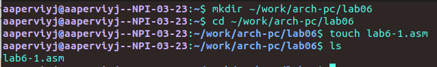{#fig:001 width=70%}

### Программа вывода значения регистра eax(I)
 
Для выполнения данного пункта лабораторной работы требуется листинг 6.1. В нем находится текст программы вывода значения регистра eax(I), который нужно ввести в файл **lab6-1.asm** (Рис.2 @fig:002)

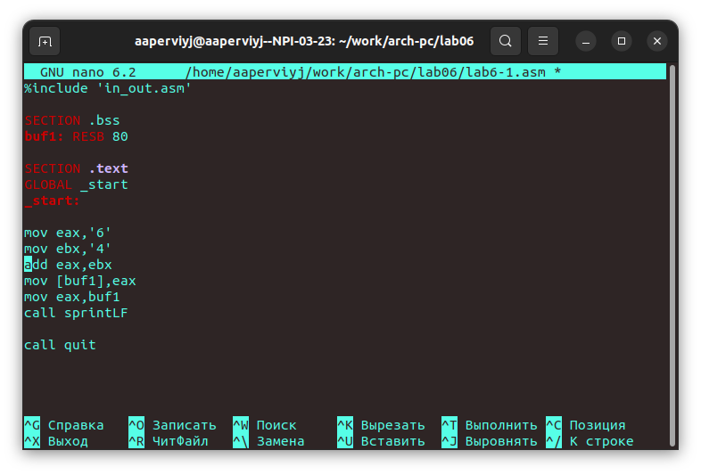{#fig:002 width=70%}

Создаю исполняемый файл и запускаю его (Рис.3 @fig:003)

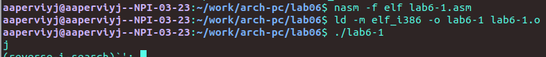{#fig:003 width=70%}

В данном случае при выводе значения регистра eax мы ожидаем увидеть число 10. Однако результатом будет символ j. Это происходит потому, что код символа 6 равен 00110110 в двоичном представлении (или 54 в десятичном представлении), а код символа 4 – 00110100 (52). Команда add eax,ebx запишет в регистр eax сумму кодов – 01101010 (106), что в свою очередь является кодом символа j (см. таблицу ASCII в приложении).

Далее изменим текст программы и вместо символов, запишем в регистры числа. (Рис.4 @fig:004)

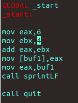{#fig:004 width=70%}

Создаю исполняемый файл и запускаю его (Рис.5 @fig:005)

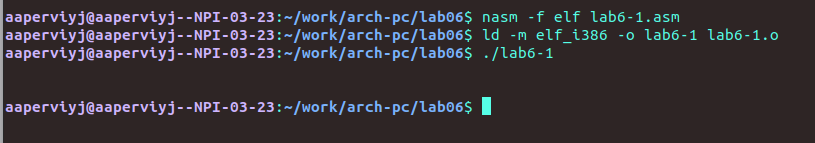{#fig:005 width=70%}

Как и в предыдущем случае при исполнении программы я не получаю число 10. В данном
случае выводится символ с кодом 10. В соответствии с таблицей ASCII я определила, что у кода 10 нет символа. Поэтому программа вывела пустую строку.

### Программа вывода значения регистра eax(II)

Как отмечалось выше, для работы с числами в файле in_out.asm реализованы подпрограммы для преобразования ASCII символов в числа и обратно. Преобразовывю текст программы из Листинга 6.1 с использованием этих функций.

Создаю файл **lab6-2.asm** в каталоге *~/work/arch-pc/lab06* (Рис.6 @fig:006) и ввожу в него текст программы из листинга 6.2 (Рис.7 @fig:007)

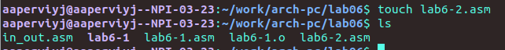{#fig:006 width=70%}

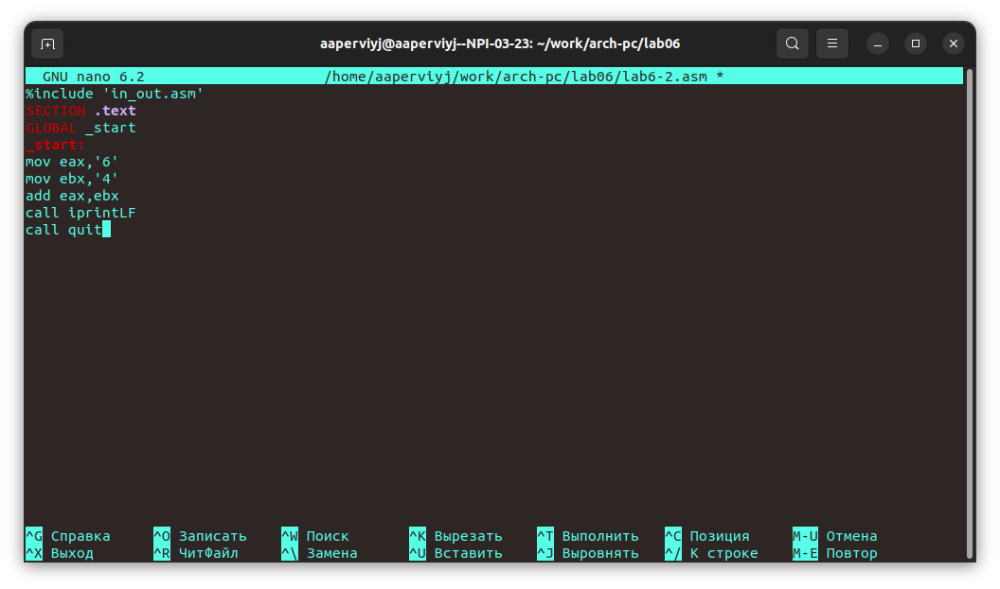{#fig:007 width=70%}

Ввела текст программы, теперь нужно создать исполняемый файл и запустить его (Рис.8 @fig:008)

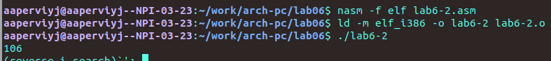{#fig:008 width=70%}

В результате работы программы я получила число 106. В данном случае, как и в первом, команда add складывает коды символов ‘6’ и ‘4’ (54+52=106). Однако, в отличии от программы из листинга 6.1, функция iprintLF позволяет вывести число, а не символ, кодом которого является это число.

Аналогично предыдущему примеру изменю символы на числа. (Рис. 9 @fig:009)

{#fig:009 width=70%}

Снова создаю исполняемый файл и запусаю его. (Рис.10 @fig:010)

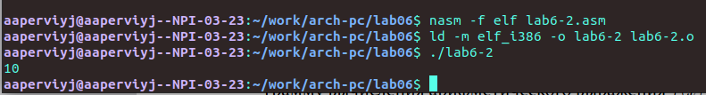{#fig:010 width=70%}

В результате работы программы я получила число 10. В данном случае, команда add складывает числа 6 и 4 (+4=10).
Теперь заменяю функцию iprintLF на iprint.(Рис.11 @fig:011) Создаю исполняемый файл и запускаю его. (Рис.12 @fig:012)

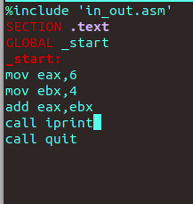{#fig:011 width=70%}

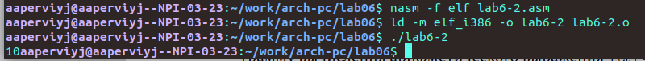{#fig:012 width=70%}

Вывод функций iprintLF и iprint отличается тем, что результат в первом случае выводится на отдельной строке. Во втором же случае число выводится на одной строке со строкой ввода.

## Выполнение арифметических операций в NASM

 В качестве примера выполнения арифметических операций в NASM приводится программа вычисления арифметического выражения 𝑓(𝑥) = (5 ∗ 2 + 3)/3.
 
 Для выполнения этого пункта неоходимо создать файл **lab6-3.asm** в каталоге *~/work/arch-pc/lab06* (Рис.13 @fig:013)
 
 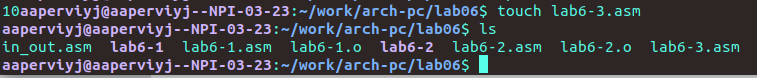{#fig:013 width=70%}

### Программа вычисления выражения

Ввожу текст программы из листинга 6.3 в файл **lab6-3.asm** (Рис.14 @fig:014)
 
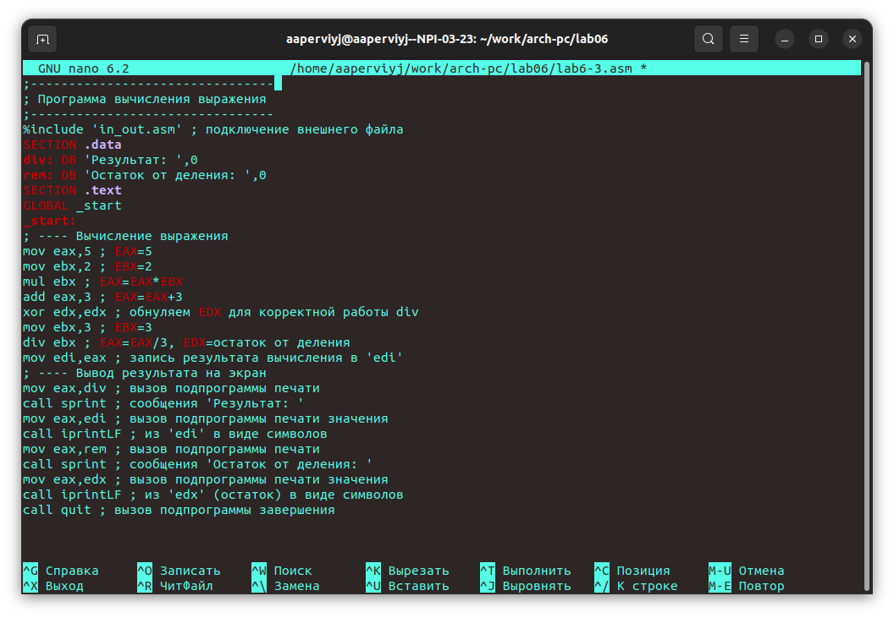{#fig:014 width=70%}

Создаю исполняемый файл и запускаю его (Рис.15 @fig:015)

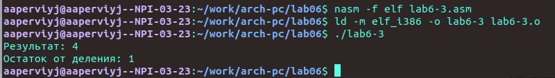{#fig:015 width=70%}

Результат работы программы должен был быть следующим:
user@dk4n31:~$ ./lab6-3
Результат: 4
Остаток от деления: 1

Такой результат я и получила. Теперь я могу изменить текст программы для вычесления выражения 𝑓(𝑥) = (4 ∗ 6 + 2)/5 (Рис.16 @fig:016)

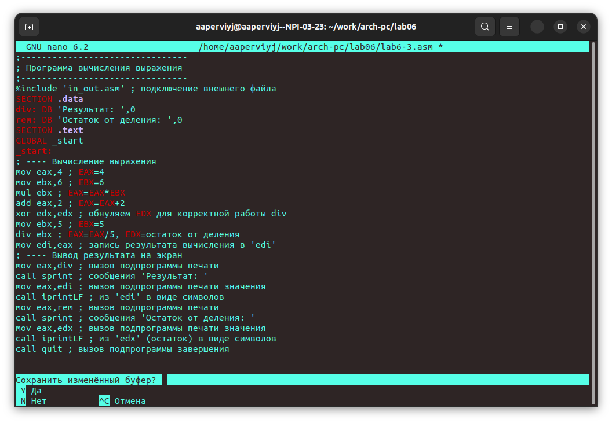{#fig:016 width=70%}

Снова создаю исполняемый файл и запускаю его (Рис.17 @fig:017)

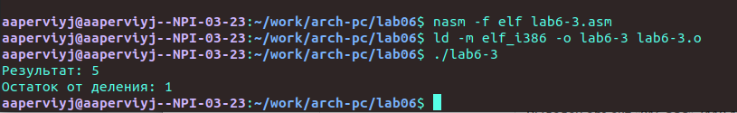{#fig:017 width=70%}

### Программа вычисления варианта задания по номеру студенческого билета

В этой программе входные данные будут вводиться с клавиатуры. Создаю файл **variant.asm** в каталоге  *~/work/arch-pc/lab06* (Рис.18 @fig:018)

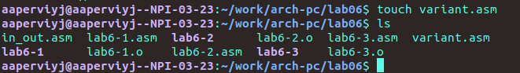{#fig:018 width=70%}

Теперь нужно ввести код программы из листинга 6.4 (Рис.19 @fig:019)

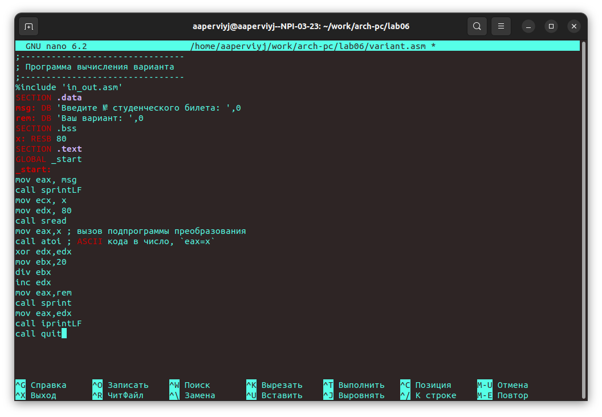{#fig:019 width=70%}

Создаю исполняемый файл и запускаю программу (Рис.20 @fig:020)

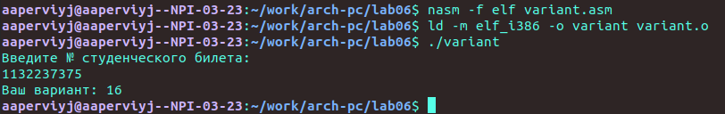{#fig:020 width=70%}

Когда прогрмма запросила № студенческого билета, я ввела свой. Результатом был 16 вариант

## Задание для самостоятельной работы

Попробую написать программу, котораяя вычислит выражение. Мне выпал 16 вариант, поэтому мне необходимо написать программу, которая вычислит следующее выражение (10𝑥 − 5)^2, число x должно вводиться пользователем. Вот программа, которая яу меня получилась(Рис.21 @fig:021):

%include        'in_out.asm'

SECTION .data
msg: DB 'Введите X: ',0
rem: DB 'Результат: ',0

SECTION .bss
x: RESB 80

SECTION .text
GLOBAL _start
_start:

; ---- Вычисление выражения
mov eax, msg
call sprint
mov ecx, x
mov edx, 80
call sread
mov eax,x
call atoi; ASCII кода в число, 'eax=x'
mov ebx, 10
mul ebx
add  eax, -5
mov ebx, eax
mul ebx
mov edi, eax

mov eax, rem
call sprint
mov eax,edi
call iprintLF

call quit

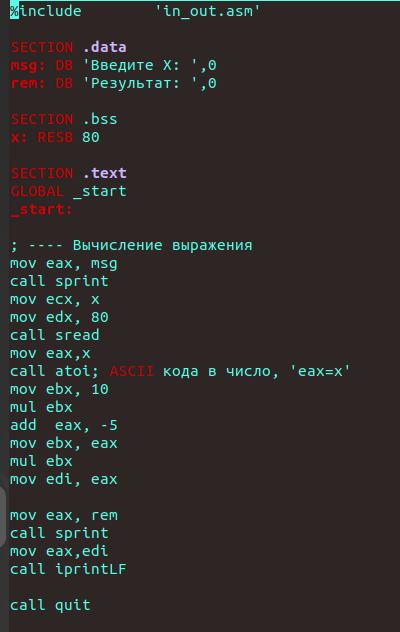{#fig:021 width=70%}

    
Теперь нужно проверить корректность этой программы (Рис.22 @fig:022)

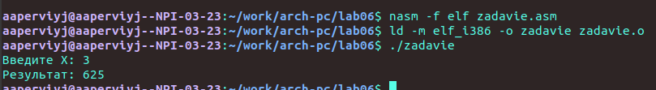{#fig:021 width=70%}

Проверяем программу арифметически: (10*3-5)^2=25^2=625

Убедились, что программа работает кореектно, значит задание выполнено.

# Выводы

Во время выполнения лабораторной работы я научилась использовать арифметические инструкции языка ассеблера NASM.

# Листинги

## Листинг 6.1. Программа вывода значения регистра eax

%include 'in_out.asm'
SECTION .bss
buf1: RESB 80
SECTION .text
GLOBAL _start
_start:
mov eax,'6'
mov ebx,'4'
add eax,ebx
mov [buf1],eax
mov eax,buf1
call sprintLF
call quit

## Листинг 6.2. Программа вывода значения регистра eax

%include 'in_out.asm'
SECTION .text
GLOBAL _start
_start:

mov eax,'6'
mov ebx,'4'
add eax,ebx
call iprintLF

call quit

## Листинг 6.3. Программа вычисления выражения 𝑓(𝑥) = (5 ∗ 2 + 3)/3

;--------------------------------
; Программа вычисления выражения
;--------------------------------

%include 'in_out.asm' ; подключение внешнего файла

SECTION .data
div: DB 'Результат: ',0
rem: DB 'Остаток от деления: ',0
SECTION .text
GLOBAL _start
_start:

; ---- Вычисление выражения
mov eax,5 ; EAX=5
mov ebx,2 ; EBX=2
mul ebx ; EAX=EAX*EBX
add eax,3 ; EAX=EAX+3
xor edx,edx ; обнуляем EDX для корректной работы div
mov ebx,3 ; EBX=3
div ebx ; EAX=EAX/3, EDX=остаток от деления

mov edi,eax ; запись результата вычисления в 'edi'

; ---- Вывод результата на экран
mov eax,div ; вызов подпрограммы печати
call sprint ; сообщения 'Результат: '
mov eax,edi ; вызов подпрограммы печати значения
call iprintLF ; из 'edi' в виде символов

mov eax,rem ; вызов подпрограммы печати
call sprint ; сообщения 'Остаток от деления: '
mov eax,edx ; вызов подпрограммы печати значения
call iprintLF ; из 'edx' (остаток) в виде символов

call quit ; вызов подпрограммы завершения

## Листинг 6.4. Программа вычисления вычисления варианта задания по номеру студенческого билета

;--------------------------------
; Программа вычисления варианта
;--------------------------------

%include 	'in_out.asm'

SECTION .data
msg: DB 'Введите № студенческого билета: ',0
rem: DB 'Ваш вариант: ',0

SECTION .bss
x: RESB 80

SECTION .text
GLOBAL _start
_start:

mov eax, msg
call sprintLF

mov ecx, x
mov edx, 80
call sread

mov eax,x ; вызов подпрограммы преобразования
call atoi ; ASCII кода в число, `eax=x`

xor edx,edx
mov ebx,20
div ebx
inc edx

mov eax,rem
call sprint
mov eax,edx
call iprintLF

call quit

# Список литературы{.unnumbered}

[Архитектура ЭВМ](https://esystem.rudn.ru/pluginfile.php/2089662/mod_resource/content/0/%D0%9B%D0%B0%D0%B1%D0%BE%D1%80%D0%B0%D1%82%D0%BE%D1%80%D0%BD%D0%B0%D1%8F%20%D1%80%D0%B0%D0%B1%D0%BE%D1%82%D0%B0%20%E2%84%966.%20%D0%90%D1%80%D0%B8%D1%84%D0%BC%D0%B5%D1%82%D0%B8%D1%87%D0%B5%D1%81%D0%BA%D0%B8%D0%B5%20%D0%BE%D0%BF%D0%B5%D1%80%D0%B0%D1%86%D0%B8%D0%B8%20%D0%B2%20NASM..pdf)
