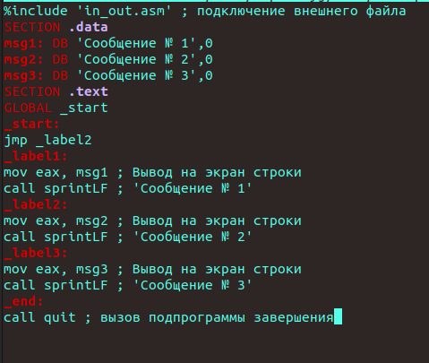
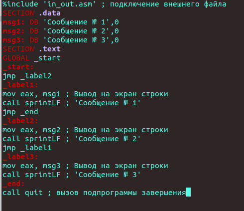
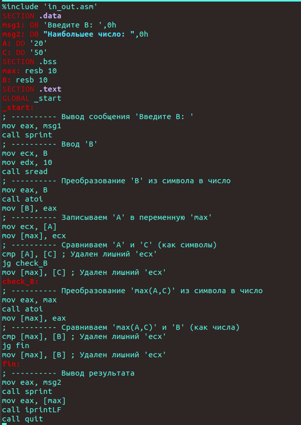
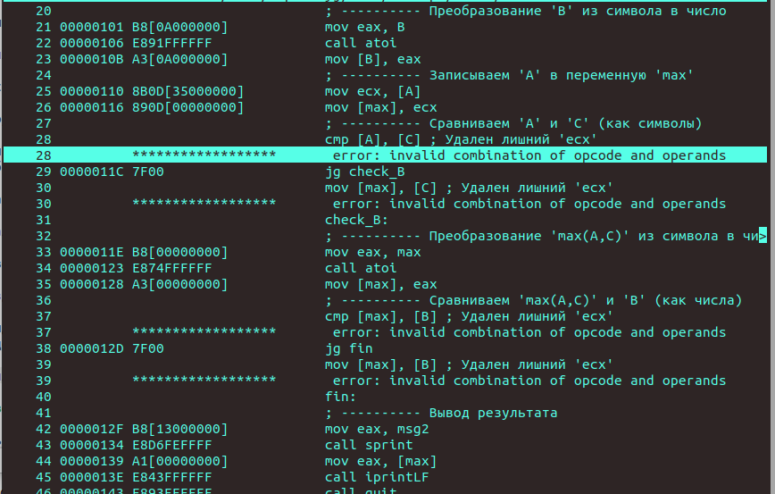
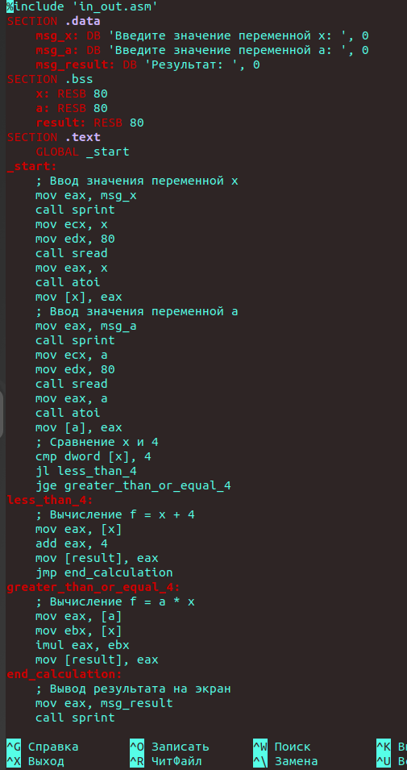

---
## Front matter
title: "ЛаБортаторная работа №7"
subtitle: "Дисциплина: Архитектура компьютера"
author: "Первий Анастасия Андреевна"

## Generic otions
lang: ru-RU
toc-title: "Содержание"

## Bibliography
bibliography: bib/cite.bib
csl: pandoc/csl/gost-r-7-0-5-2008-numeric.csl

## Pdf output format
toc: true # Table of contents
toc-depth: 2
lof: true # List of figures
lot: true # List of tables
fontsize: 12pt
linestretch: 1.5
papersize: a4
documentclass: scrreprt
## I18n polyglossia
polyglossia-lang:
  name: russian
  options:
	- spelling=modern
	- babelshorthands=true
polyglossia-otherlangs:
  name: english
## I18n babel
babel-lang: russian
babel-otherlangs: english
## Fonts
mainfont: PT Serif
romanfont: PT Serif
sansfont: PT Sans
monofont: PT Mono
mainfontoptions: Ligatures=TeX
romanfontoptions: Ligatures=TeX
sansfontoptions: Ligatures=TeX,Scale=MatchLowercase
monofontoptions: Scale=MatchLowercase,Scale=0.9
## Biblatex
biblatex: true
biblio-style: "gost-numeric"
biblatexoptions:
  - parentracker=true
  - backend=biber
  - hyperref=auto
  - language=auto
  - autolang=other*
  - citestyle=gost-numeric
## Pandoc-crossref LaTeX customization
figureTitle: "Рис."
tableTitle: "Таблица"
listingTitle: "Листинг"
lofTitle: "Список иллюстраций"
lotTitle: "Список таблиц"
lolTitle: "Листинги"
## Misc options
indent: true
header-includes:
  - \usepackage{indentfirst}
  - \usepackage{float} # keep figures where there are in the text
  - \floatplacement{figure}{H} # keep figures where there are in the text
---

# Цель работы

Целью лабораторной работы является изучение команд усновного и безусловного переходов, приобретение навыков написания программ с использованием переходов, а также знакомство с назначением и структурой файла листинга.

# Задание

0. Общее ознакомление с командами условного и безусловного переходов.
1. Реализация переходов в NASM.
2. Изучение структуры файла листинга.
3. Выполнение заданий для самостоятельной работы.

# Теоретическое введение

Для реализации ветвлений в ассемблере используются так называемые команды передачи управления или команды перехода. Можно выделить 2 типа переходов: • условный переход – выполнение или не выполнение перехода в определенную точку программы в зависимости от проверки условия. • безусловный переход – выполнение передачи управления в определенную точку программы без каких-либо условий. Безусловный переход выполняется инструкцией jmp (от англ. jump – прыжок), которая включает в себя адрес перехода, куда следует передать управление. Адрес перехода может быть либо меткой, либо адресом области памяти, в которую предварительно помещен указатель перехода. Кроме того, в качестве операнда можно использовать имя регистра, в таком случае переход будет осуществляться по адресу, хранящемуся в этом регистре Как отмечалось выше, для условного перехода необходима проверка какого-либо условия. В ассемблере команды условного перехода вычисляют условие перехода анализируя флаги из регистра флагов. Флаг – это бит, принимающий значение 1 («флаг установлен»), если выполнено некоторое условие, и значение 0 («флаг сброшен») в противном случае. Флаги работают независимо друг от друга, и лишь для удобства они помещены в единый регистр — регистр флагов, отражающий текущее состояние процессора. Инструкция cmp является одной из инструкций, которая позволяет сравнить операнды и выставляет флаги в зависимости от результата сравнения. Инструкция cmp является командой сравнения двух операндов и имеет такой же формат, как и команда вычитания Мнемоника перехода связана со значением анализируемых флагов или со способом формирования этих флагов. Листинг (в рамках понятийного аппарата NASM) — это один из выходных файлов, создаваемых транслятором. Он имеет текстовый вид и нужен при отладке программы, так как кроме строк самой программы он содержит дополнительную информацию. Все ошибки и предупреждения, обнаруженные при ассемблировании, транслятор выводит на экран, и файл листинга не создаётся. Итак, структура листинга: • номер строки — это номер строки файла листинга (нужно помнить, что номер строки в файле листинга может не соответствовать номеру строки в файле с исходным текстом программы); • адрес — это смещение машинного кода от начала текущего сегмента; • машинный код представляет собой ассемблированную исходную строку в виде шестнадцатеричной последовательности. (например, инструкция int 80h начинается по смещению 00000020 в сегменте кода; далее идёт машинный код, в который ассемблируется инструкция, то есть инструкция int 80h ассемблируется в CD80 (в шестнадцатеричном представлении); CD80 — это инструкция на машинном языке, вызывающая прерывание ядра); исходный текст программы — это просто строка исходной программы вместе с комментариями (некоторые строки на языке ассемблера, например, строки, содержащие только комментарии, не генерируют никакого машинного кода, и поля «смещение» и «исходный текст программы» в таких строках отсутствуют, однако номер строки им присваивается)

# Выполнение лабораторной работы

Перед тем как начать выполнять лабораторную работу, необходимо создать директорию и файл, в которых я и буду работать, для этого прописываю следующие команды (Рис.1):

mkdir ~/work/arch-pc/lab07
cd ~/work/arch-pc/lab07
touch lab7-1.asm

{width=70%}

Теперь, после того, как я создала пространство для дальшейней работы, я могу переходить к следующему пункту

## Реализация переходов в NASM

Открываю созданный файл lab7-1.asm, вставляю в него следующую программу из листинга 7.1: (Рис.2)

{width=70%)

Копирую в текущий каталог файл in_out.asm с помощью утилиты cp, так как он будет использоваться в дальнейшем. Выполняю компиляцию, компоновку файла и запускаю его. Замечу, что использование инструкции jmp _label2 меняет порядок исполнения инструкций и позволяет выполнить инструкции начиная с метки _label2, пропустив вывод первого сообщения (Рис.3).

{width=70%)

Добавляю в текст метки jmp_label1 jmp_end. Программа представлена в листинге 7.2(Рис.4)

{width=70%)

Создаю новый исполняемый файл программы и запускаю его. Соответственно, инструкция jmp позволяет осуществлять переходы не только вперед но и назад. (Рис.5).

{width=70%)

Изменяю метки jmp в программе, чтобы выводились сообщения в порядке от 3 до 1 (Рис.6)

{width=70%)

Выполняю компиляцию и компоновку, и запускаю исполняемый файл. Все работает так, как нужно. (Рис.7).

{width=70%)

Создаю файл lab7-2.asm. Редактирую его, вводя предлагаемую программу из листинга 7.3 (Рис.8):

{width=70%)

Создаю исполняемый файл и проверяю его работу для разных целочисленных значений В(Рис.9):

{width=70%)

## Изучение структуры файла листинга

Получаю файл листинга для программы lab7-2, указав ключ -l и введя имя листинга в командной строке(Рис.10):

{width=70%)

Открываю полученный файл листинга в MC(Рис.11):

{width=70%)

Объяснение строк:

Инструкция mov ecx,B используется, чтобы положить адрес вводимой строки B в регистр ecx. call sread - вызов подпрограммы из внешнего файла, обеспечивающей ввод сообщения с клавиатуры. call atoi используется для вызова подпрограммы из внешнего файла, которая преобразует ascii-код символа в целое число и записывает результат в регистр eax.

Убираю один из операндов в инструкции двумя операндами(Рис.12):

{width=70%)

Заново создаю листинг(Рис.13)

{width=70%)

Мы видим ошибку, но файл листинга создаётся. Открываю его. Также на месте строки находится сообщение об ошибке(Рис.14)

{width=70%)

## Самостоятельная работа

Для выполнения самостоятельной работы, создаю файл sr-1.asm, с помощью утилиты touch. Открываю созданный файл, ввожу в него текст программы для определения наименьшего числа из 3-х, предложенных в варианте 16, получееным мной во время выполнении прошлой лабораторной работы(Рис.15):

{width=70%)

Проводим привычные операции и запускаем исполняемый файл, выполняем устную проверку(должно получиться 17) и убеждаемся в правильности работы программы(Рис.16):

{width=70%)

Создаю файл sr-2.asm с помощью утилиты touch. Открываю созданный файл для редактирования, ввожу в него текст программы для своего 16-го варианта: f = x + 4, если x < a и f = a * x, если x >= 4 (Рис.17)

{width=70%)

Компилирую, обрабатываю и запускаю исполняемый файл. Ввожу предложенные значения, и, сделав проверку, понимаю, что программа работает верно(Рис.18)

{width=70%)

# Выводы

При выполнении лабораторной работы я изучила команды условного и безусловного переходов, приобрела практический опыт в написании программ с использованием переходов, познакомилась с назначением и структурой файла листинга.

# Листинги

## Листинг 7.1. Программа с использованием инструкции jmp

'''nasm

(text)

%include 'in_out.asm' ; подключение внешнего файла
SECTION .data
msg1: DB 'Сообщение № 1',0
msg2: DB 'Сообщение № 2',0
msg3: DB 'Сообщение № 3',0
SECTION .text
GLOBAL _start
_start:
jmp _label2
_label1:
mov eax, msg1 ; Вывод на экран строки
call sprintLF ; 'Сообщение № 1'
_label2:
mov eax, msg2 ; Вывод на экран строки
call sprintLF ; 'Сообщение № 2'
_label3:
mov eax, msg3 ; Вывод на экран строки
call sprintLF ; 'Сообщение № 3'
_end:
call quit ; вызов подпрограммы завершения

'''

## Листинг 7.2. Программа с использованием инструкции jmp

'''nasm

(text)

%include 'in_out.asm' ; подключение внешнего файла
SECTION .data
msg1: DB 'Сообщение № 1',0
msg2: DB 'Сообщение № 2',0
msg3: DB 'Сообщение № 3',0
SECTION .text
GLOBAL _start
_start:
jmp _label2
_label1:
mov eax, msg1 ; Вывод на экран строки
call sprintLF ; 'Сообщение № 1'
jmp _end
_label2:
mov eax, msg2 ; Вывод на экран строки
call sprintLF ; 'Сообщение № 2'
jmp _label1
_label3:
mov eax, msg3 ; Вывод на экран строки
call sprintLF ; 'Сообщение № 3'
_end:
call quit ; вызов подпрограммы завершения

'''

## Листинг 7.3. Программа, которая определяет и выводит на экран наибольшую из 3 целочисленных переменных: A,B и C.

'''nasm

(text)

%include 'in_out.asm'
section .data
msg1 db 'Введите B: ',0h
msg2 db "Наибольшее число: ",0h
A dd '20'
C dd '50'
section .bss
max resb 10
B resb 10
section .text
global _start
_start:
; ---------- Вывод сообщения 'Введите B: '
mov eax,msg1
call sprint
; ---------- Ввод 'B'
mov ecx,B
mov edx,10
call sread
; ---------- Преобразование 'B' из символа в число
mov eax,B
call atoi ; Вызов подпрограммы перевода символа в число
mov [B],eax ; запись преобразованного числа в 'B'
; ---------- Записываем 'A' в переменную 'max'
mov ecx,[A] ; 'ecx = A'
mov [max],ecx ; 'max = A'
; ---------- Сравниваем 'A' и 'С' (как символы)
cmp ecx,[C] ; Сравниваем 'A' и 'С'
jg check_B ; если 'A>C', то переход на метку 'check_B',
mov ecx,[C] ; иначе 'ecx = C'
mov [max],ecx ; 'max = C'
; ---------- Преобразование 'max(A,C)' из символа в число
check_B:
mov eax,max
call atoi ; Вызов подпрограммы перевода символа в число
mov [max],eax ; запись преобразованного числа в `max`
; ---------- Сравниваем 'max(A,C)' и 'B' (как числа)
mov ecx,[max]
cmp ecx,[B] ; Сравниваем 'max(A,C)' и 'B'
jg fin ; если 'max(A,C)>B', то переход на 'fin',
mov ecx,[B] ; иначе 'ecx = B'
mov [max],ecx
; ---------- Вывод результата
fin:
mov eax, msg2
call sprint ; Вывод сообщения 'Наибольшее число: '
mov eax,[max]
call iprintLF ; Вывод 'max(A,B,C)'
call quit ; Выход

'''

## Листинг 1. Программа, которая определяет и выводит на экран наименбшую из 3 целочисленных переменных: A,B и C.

'''nasm

(text)

%include 'in_out.asm'
SECTION .data
msg1 DB "Наименьшее число: ", 0h
A DD '44'
B DD '74'
C DD '17'
SECTION .bss
min resb 10
SECTION .text
GLOBAL _start
_start:
    ; ---------- Преобразование 'A' из символа в число
    mov eax, A
    call atoi
    mov [A], eax
    ; ---------- Преобразование 'B' из символа в число
    mov eax, B
    call atoi
    mov [B], eax
    ; ---------- Преобразование 'C' из символа в число
    mov eax, C
    call atoi
    mov [C], eax
    ; ---------- Записываем 'A' в переменную 'min'
    mov ecx, [A]
    mov [min], ecx
    ; ---------- Сравниваем 'A' и 'B'
    cmp ecx, [B]
    jl check_C
    ; ---------- Если 'A >= B', то 'min = B'
    mov ecx, [B]
    mov [min], ecx
    jmp check_C
check_C:
    ; ---------- Сравниваем 'min' и 'C'
    cmp ecx, [C]
    jl fin
    ; ---------- Если 'min >= C', то 'min = C'
    mov ecx, [C]
    mov [min], ecx
fin:
    ; ---------- Вывод результата
    mov eax, msg1
    call sprint
    mov eax, [min]
    call iprintLF
    call quit

'''

## Листинг 2. Программа, которая для введенных с клавиатуры значений 𝑥 и 𝑎 вычисляет значение заданной функции 𝑓(𝑥) и выводит результат вычислений

'''nasm

(text)
%include 'in_out.asm'
SECTION .data
    msg_x: DB 'Введите значение переменной x: ', 0
    msg_a: DB 'Введите значение переменной a: ', 0
    msg_result: DB 'Результат: ', 0
SECTION .bss
    x: RESB 80
    a: RESB 80
    result: RESB 80
SECTION .text
    GLOBAL _start
_start:
    ; Ввод значения переменной x
    mov eax, msg_x
    call sprint
    mov ecx, x
    mov edx, 80
    call sread
    mov eax, x
    call atoi
    mov [x], eax
    ; Ввод значения переменной a
    mov eax, msg_a
    call sprint
    mov ecx, a
    mov edx, 80
    call sread
    mov eax, a
    call atoi
    mov [a], eax
    ; Сравнение x и 4
    cmp dword [x], 4
    jl less_than_4
    jge greater_than_or_equal_4
less_than_4:
    ; Вычисление f = x + 4
    mov eax, [x]
    add eax, 4
    mov [result], eax
    jmp end_calculation
greater_than_or_equal_4:
    ; Вычисление f = a * x
    mov eax, [a]
    mov ebx, [x]
    imul eax, ebx
    mov [result], eax
end_calculation:
    ; Вывод результата на экран
    mov eax, msg_result
    call sprint
    mov eax, [result]
    call iprintLF
    call quit
    
    '''

